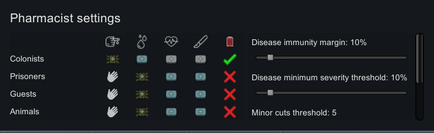

==========
Pharmacist
==========
.. image:: About/preview.png

Control what kind of medicine is used for different pawn types with varying severities of injury.

The best quality medicine set on an individual pawn will not be overridden by this mod.

Note: This is an updated version of `fluffy's Pharmacist mod`_ and `DomBarber's Lung Rot fix`_. It adds the ability to automatically transfuse pawns based on a blood loss threshold.

Parts of this mod were created by, or derived from works created by;

    srip: blood, hospital icons (BY-NC)
    Freepik: scalpel icon (BY-NC)
    Good Ware: heart icon (BY-NC)
    Smashicons: finger icon (BY-NC)

.. _fluffy's Pharmacist mod: https://github.com/fluffy-mods/Pharmacist
.. _DomBarber's Lung Rot fix: https://github.com/DomBarber/Pharmacist/tree/LungRotFix
